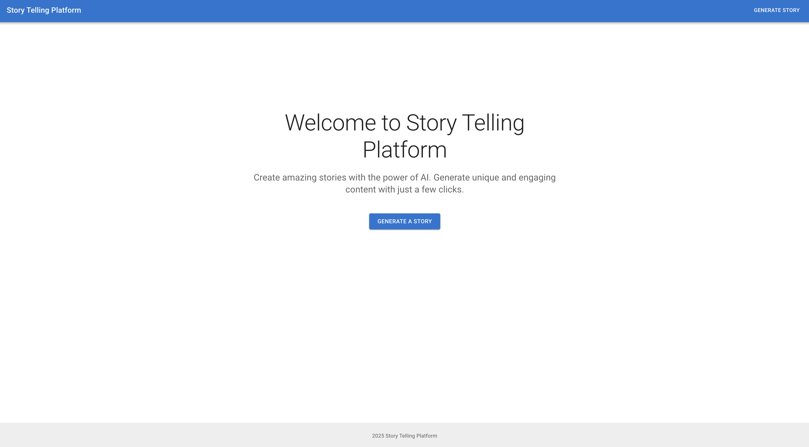
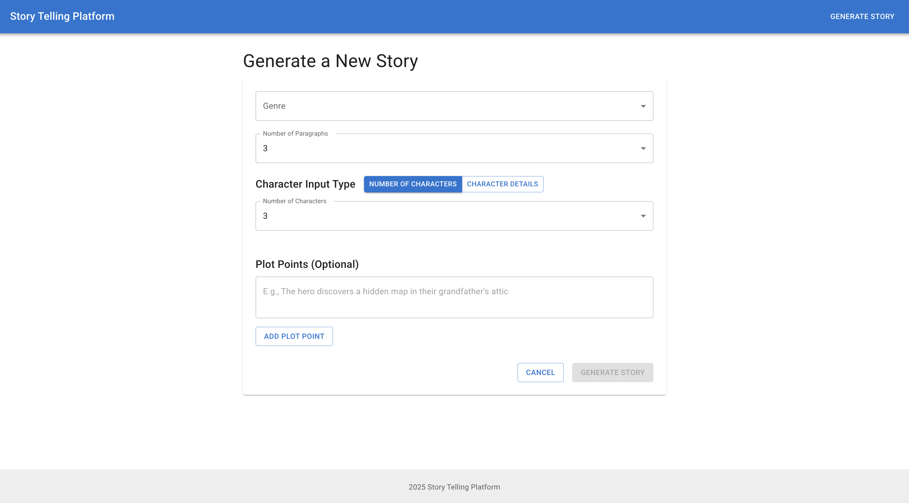
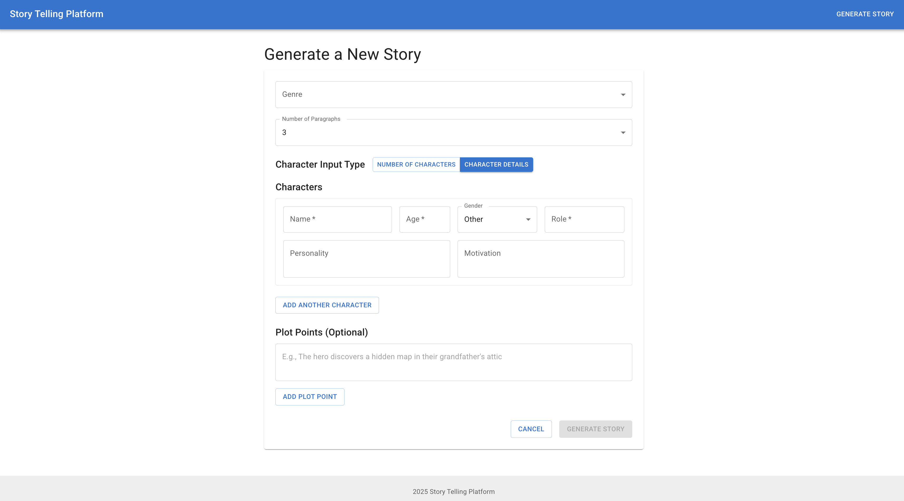
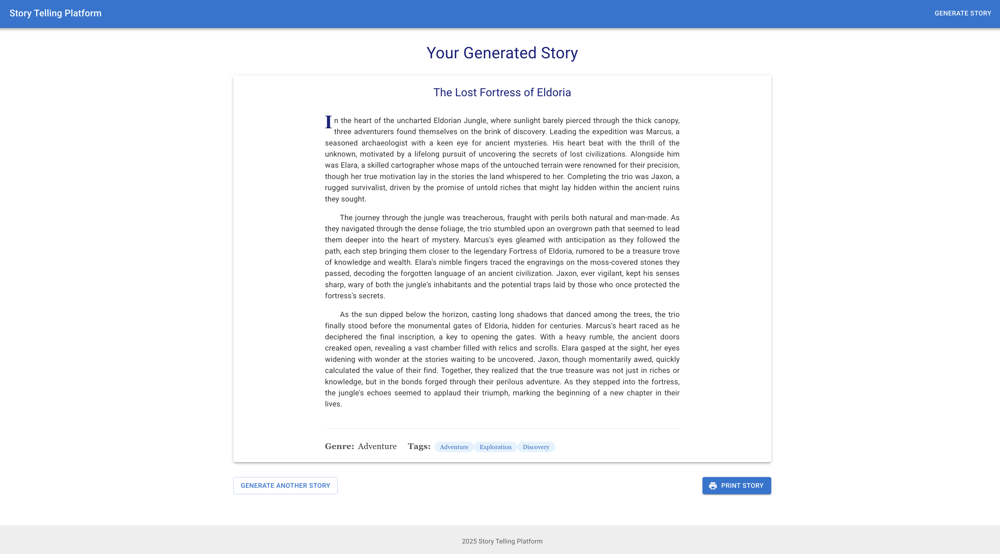
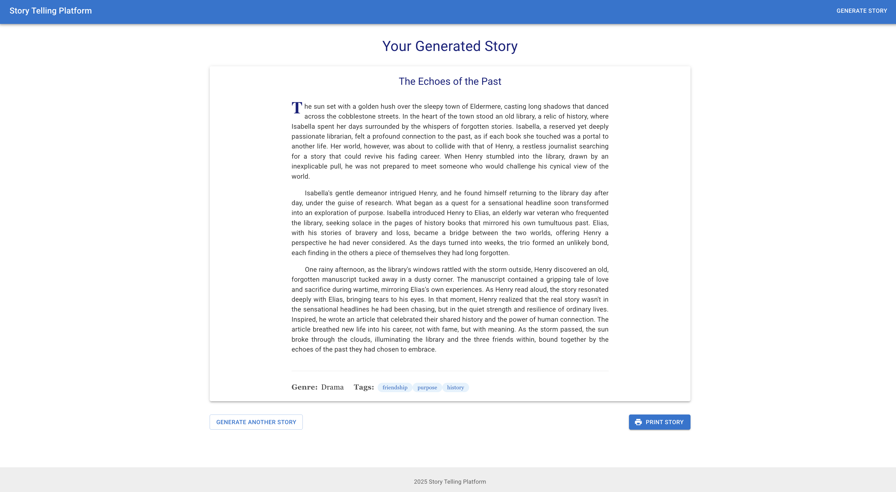

# AI-Powered Storytelling Platform

An interactive web application that generates personalized stories using AI models from OpenAI, LangChain, and local LLMs via Ollama. Users can provide inputs and receive AI-generated stories based on their preferences.

## Features

- Interactive web interface for story generation
- Multiple AI backends:
  - OpenAI's language models (GPT-3.5, GPT-4)
  - LangChain for advanced prompting and chaining
  - Local LLMs via Ollama for offline/private use
- Customizable story parameters (genre, characters, plot points)
- Responsive design for desktop and mobile devices
- Secure API key management

## Screenshots

### 1. Home Page

*The main landing page of the Story Telling Platform*

### 2. Story Generation Form



*Interface for entering story parameters and generating new stories*

### 3. Generated Stories

#### Story Example 1

*An example of a generated story with the specified parameters*

#### Story Example 2

*Another example showing different story generation results*

## Prerequisites

- Python 3.8+
- pip (Python package manager)
- AI Model Access (choose one or more):
  - OpenAI API key (sign up at [OpenAI](https://openai.com/))
  - [Ollama](https://ollama.ai/) installed for local LLM support
- Node.js and npm (for frontend development)

## Quick Start

### Backend Setup

1. **Clone the repository**
   ```bash
   git clone https://github.com/narendra-cs/Story-Telling-Platform.git
   cd Story-Telling-Platform
   ```

2. **Create and activate virtual environment**
   ```bash
   # On macOS/Linux
   python3 -m venv venv
   source venv/bin/activate
   
   # On Windows
   python -m venv venv
   .\venv\Scripts\activate
   ```

3. **Install Python dependencies**
   ```bash
   pip install -r requirements.txt
   ```

4. **Set up environment variables**
   Create a `.env` file in the project root and add your preferred API keys:
   ```
   # Required for OpenAI
   OPENAI_API_KEY=your_openai_api_key_here
   
   # Optional: For LangChain specific settings
   LANGCHAIN_API_KEY=your_langchain_api_key_here
   LANGCHAIN_PROJECT=your_langchain_project_here
   ```

5. **Run the backend server**
   ```bash
   python -m src.main
   ```

### Using Ollama (Optional)

If you want to use local LLMs via Ollama:

1. Install Ollama from [ollama.ai](https://ollama.ai/)
2. Start the Ollama server:
   ```bash
   ollama serve
   ```
3. Pull a model (e.g., Llama 3.2):
   ```bash
   ollama pull llama3.2
   ```

### Frontend Setup

1. **Navigate to the frontend directory**
   ```bash
   cd frontend
   ```

2. **Install Node.js dependencies**
   ```bash
   npm install
   ```

3. **Start the development server**
   ```bash
   npm run dev
   ```

4. **Open the application**
   Visit `http://localhost:8080` in your browser

## Project Structure

```
Story-Telling-Platform/
├── src/                    # Backend source code
│   ├── __init__.py
│   ├── main.py            # FastAPI application
│   ├── llm/               # LLM integration
│   │   ├── __init__.py
│   │   └── utils.py       # Utility functions
│   └── api/               # API endpoints
│       └── endpoints.py
├── frontend/              # Frontend application
│   ├── public/
│   ├── src/
│   │   ├── components/    # React components
│   │   ├── pages/         # Application pages
│   │   └── App.js         # Main application component
│   └── package.json
├── tests/                 # Test files
├── .env.example           # Example environment variables
├── requirements.txt       # Python dependencies
├── README.md              # This file
└── .gitignore
```

## Configuration

You can configure the application by setting the following environment variables:

| Variable | Description | Required | Default |
|----------|-------------|----------|---------|
| `OPENAI_API_KEY` | Your OpenAI API key | Only for OpenAI | - |
| `LANGCHAIN_API_KEY` | LangChain API key | No | - |
| `LANGCHAIN_PROJECT` | LangChain project name | No | - |

## Testing

Run the test suite with pytest:

```bash
pytest tests/
```

## Environment Variables

| Variable | Description | Required |
|----------|-------------|----------|
| `OPENAI_API_KEY` | Your OpenAI API key | 

## Contributing

1. Fork the repository
2. Create your feature branch (`git checkout -b feature/amazing-feature`)
3. Commit your changes (`git commit -m 'Add some amazing feature'`)
4. Push to the branch (`git push origin feature/amazing-feature`)
5. Open a Pull Request

## License

This project is licensed under the MIT License - see the [LICENSE](LICENSE) file for details.

## Acknowledgments

- [FastAPI](https://fastapi.tiangolo.com/) for the backend framework
- [React](https://reactjs.org/) for the frontend library
- [OpenAI](https://openai.com/) for the LLM integration
- [LangChain](https://www.langchain.com/) for advanced LLM orchestration
- [Ollama](https://ollama.ai/) for local LLM support
